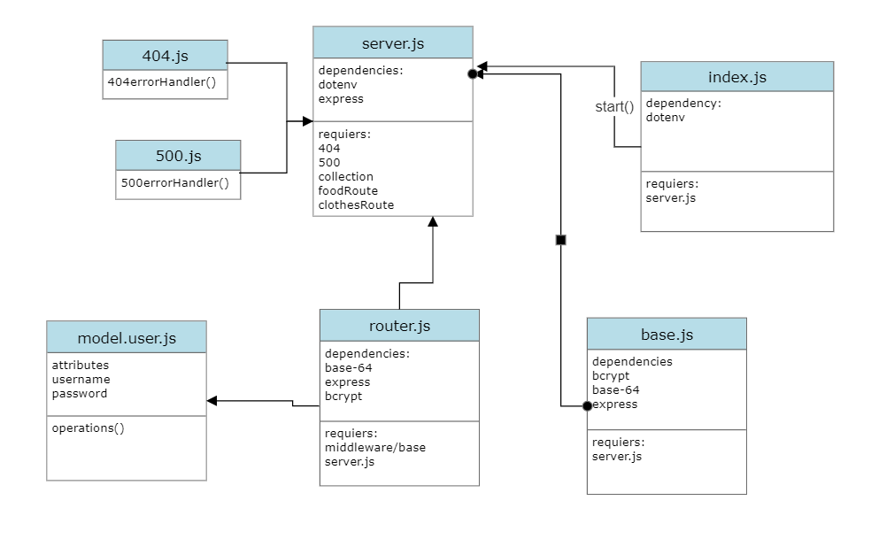

# basic-auth

[gitHub]()

[Action]()

[pullRequest]()

[heroku]()

**basic-auth module that is designed to handle user registration and sign in using Basic**

Create a basic express server with the following features:

Users Model (sql Schema)

/signup route that creates a user

/signin route that attempts to log a user in

BasicAuth middleware that validates the user as a part of the /signin process

## Basic Server

1-index.js==entry point

2-server.js ==service wiring

## uthentication Modules

middlewares/base.js :contain function working as middware to authnticate the user and returen user datae if valid or error message if user not valid
 

models/user.js: contain schema for user

router.js:contain /signin and /signup router

##WE Testing

I use thender client to test these :

1-POST to /signup to create a new user

2-POST to /signin to login as a user (use basic auth)

